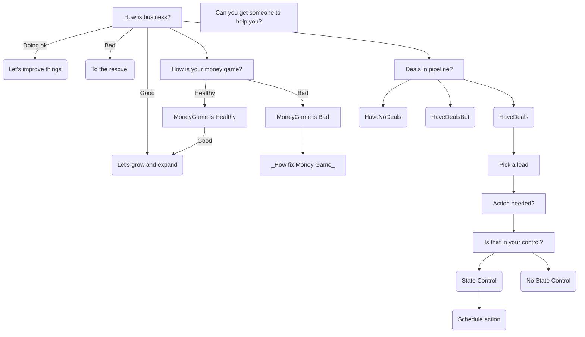

```mermaid
graph TD;
%% Naming convention: q=question, a=answer, St=current state, i=instruction
%% 

q1[How is business?]
a1q1(Let's grow and expand)
a2q1(Let's improve things)
a3q1(To the rescue!)
  q1 & St1 -->|Good|a1q1 
  q1 -->|Doing ok| a2q1
  q1 -->|Bad| a3q1
    q1 --> q2
    q1 --> q4


q2[How is your money game?]
St1[MoneyGame is Healthy]
St2[MoneyGame is Bad]
  q2 -->|Healthy| St1
  q2 -->|Bad| St2  
    St2 --> q3

q3[_How fix Money Game_]

q4[Deals in pipeline?]
a1q4(HaveDeals)
a2q4(HaveNoDeals)
a3q4(HaveDealsBut)
  q4 -->a1q4
  q4 -->a2q4
  q4 -->a3q4

a1q4--> iPickSQL[Pick a lead]-->

qNeedAction[Action needed?]-->
  qActionControl[Is that in your control?]--> 
    stControl(State Control)-->
      iSchedule(Schedule action)
    stNoControl(No State Control)
      qDelegate[Can you get someone to help you?]
  qActionControl[Is that in your control?]-->
    stNoControl(No State Control)
```